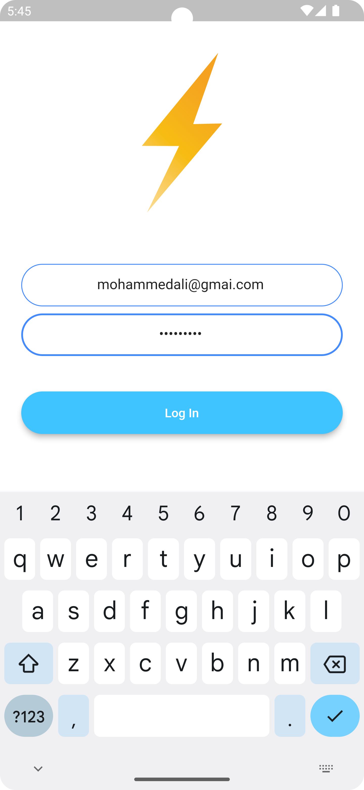
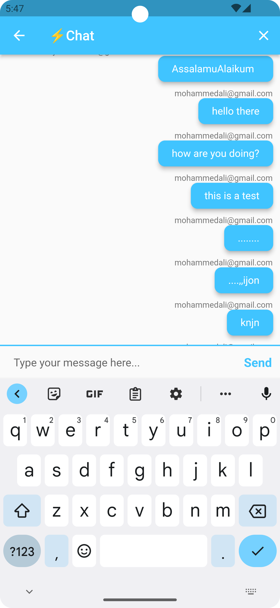
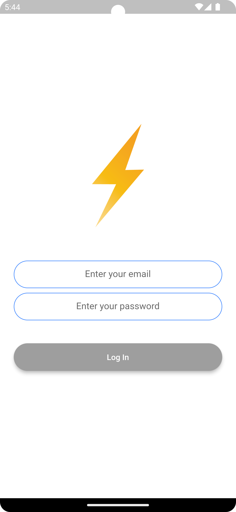
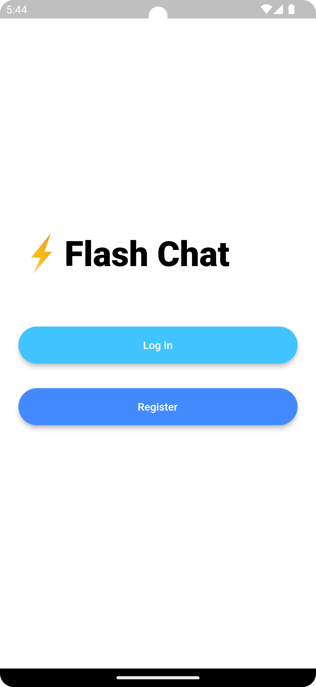

# Flutter Chat App

This project is a chat application developed in Flutter using Firebase for authentication and data storage.

## Features

- User Registration
- User Login
- Real-time Messaging

## Screenshots

Here are some screenshots of the application in action:

<div style="display: flex; justify-content: space-around;">
  
  
  
  
</div>

## Installation and Usage

Firstly, clone this repository. Then navigate to the project's directory and run the following command to fetch the dependencies:

```shell
flutter pub get
